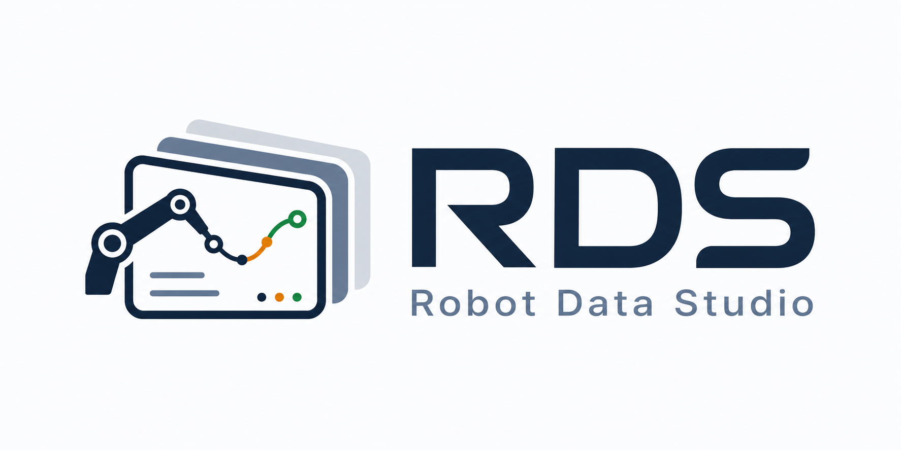
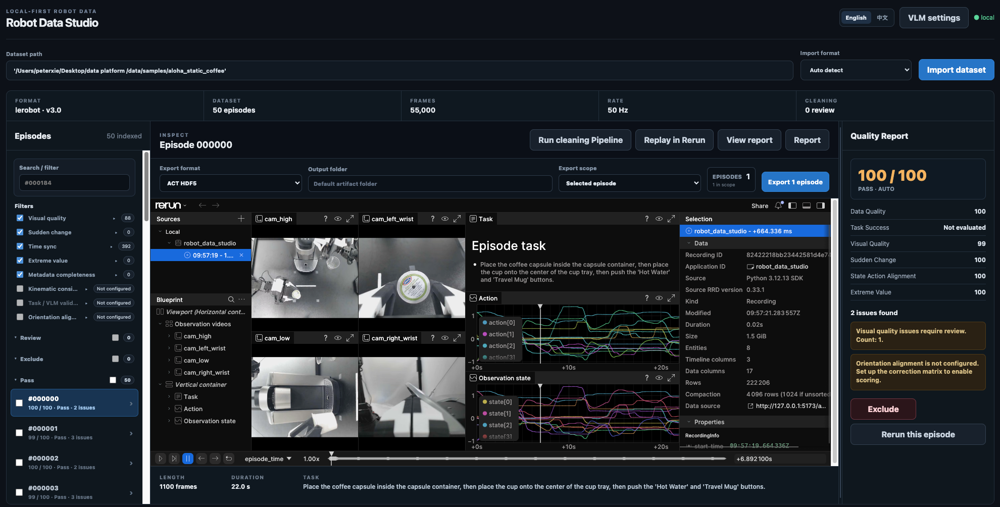

# Robot Data Studio

**English** | **[简体中文](README.zh-CN.md)**

<p align="center">
  
</p>

Robot Data Studio (RDS) is a **local-first** workbench for inspecting, cleaning, reviewing, replaying, and converting robot datasets. It focuses on pre-training data QA: import a local dataset, understand each episode’s quality, replay video and state/action with Rerun, filter bad data, and export to formats your downstream training stack can use.

**RDS does not modify your source dataset.** Generated Rerun recordings, cleaning state, exports, and reports are written under `.rds-artifacts/` at the project root.

## Preview

<p align="center">
  
</p>

*Workspace overview: import a dataset, inspect episodes, replay multi-camera video in Rerun, run the quality pipeline, and export clean data—all from one browser UI.*

## Why RDS

### Fully local — your data stays on your machine

RDS runs on your computer. Datasets remain on your disk and are not uploaded to the cloud. Import, QA, replay, and export all happen locally—suitable for teams with privacy or compliance requirements.

### One unified workbench

RDS brings scattered pre-training steps into a single UI instead of juggling multiple scripts and tools:

1. **Mainstream format import and conversion** — Import LeRobot v3, ACT HDF5, robomimic HDF5, UMI Zarr, and more; export to common downstream training formats.
2. **Integrated filtering and cleaning** — Built-in quality pipeline covering visual, kinematic, metadata, and other checks; automated scoring, human review, and report export in one flow.
3. **Built-in visualization** — Rerun replay for observation video, state/action curves, and timelines, plus report dashboards and signal charts to quickly find problematic episodes.

### Full workflow in the browser, extensible in code

**No command line for day-to-day use:** import paths, select checks, run the pipeline, read reports, Rerun replay, manual decisions, and export—all from the web UI. To customize rules, add formats, or extend APIs, edit frontend and backend code under `apps/` and `packages/`.

## What you can do

Typical workflow:

```text
Import dataset → Select checks and run scope → Run quality pipeline → Read cleaning report
→ Locate problematic episodes → Rerun replay and manual decisions → Export clean data
```

**Import formats (auto-detect or manual):**

- LeRobot v3
- ACT HDF5
- robomimic HDF5
- UMI Zarr

**Export formats:**

- ACT HDF5
- robomimic HDF5
- UMI Zarr
- LeRobot v3
- LeRobot v2.1

Quality checks include visual quality, sudden changes, state/action alignment, extreme values, metadata completeness, kinematic consistency, orientation alignment, and optional VLM task-success scoring. After the pipeline finishes, review the report dashboard, quality distribution, findings, signal charts, and recommended actions.

## Requirements

- Python 3.11+
- Node.js 20+
- pnpm 11.7.0
- Recommended browser: Chrome / Chromium
- Optional: `ffmpeg` (VLM video frame extraction)
- Kinematic consistency checks use Pinocchio (`pip install -e '.[dev]'` includes the `pin` package)

If pnpm is not installed, enable the pinned version with corepack:

```bash
corepack enable
corepack prepare pnpm@11.7.0 --activate
```

## Installation

From the repository root:

```bash
python3 -m venv .venv
source .venv/bin/activate
python -m pip install --upgrade pip
python -m pip install -e '.[dev]'
pnpm install
```

`.[dev]` installs the backend, test dependencies, and Pinocchio. RDS ships a lightweight LeRobot reader and does not require the official `lerobot` package by default. If a compatible official writer is installed, exports prefer it; otherwise a local fallback is used.

**Optional: download sample data**

The first-time walkthrough below uses the smaller PushT sample:

```bash
python scripts/download_sample.py
```

Sample data is saved to `data/samples/lerobot-pusht`.

For multi-camera replay and report-signal coverage in the test suite, optionally download the ALOHA sample (larger):

```bash
python scripts/download_hf_dataset.py --repo lerobot/aloha_static_coffee
```

Data is saved to `data/samples/aloha_static_coffee`.

## Startup

Use two terminals, both from the repository root.

**Terminal 1 — backend:**

```bash
source .venv/bin/activate
uvicorn apps.api.main:app --reload --host 127.0.0.1 --port 8000
```

**Terminal 2 — frontend:**

```bash
pnpm dev:web
```

Open [http://127.0.0.1:5173/](http://127.0.0.1:5173/). Confirm the backend at [http://127.0.0.1:8000/api/health](http://127.0.0.1:8000/api/health).

## First-time walkthrough

Complete one end-to-end loop in this order:

1. **Import a dataset** — Enter the local dataset root in `Dataset path` (not a child file like `meta/info.json`) and click import. `Import format` defaults to `Auto detect`; pick a format manually if detection fails. Leading/trailing `'` or `"` in the path are stripped automatically.
2. **Choose run scope and checks** — In the sidebar, enable quality checks and choose whether to run on all episodes or only selected ones.
3. **Optional advanced setup** — Upload a URDF and configure joint mapping for kinematic consistency; enable task-success checks in `VLM settings` (requires an API key and `ffmpeg`).
4. **Run the quality pipeline** — Click run and wait for progress to finish. Each episode is labeled passed, needs review, or excluded.
5. **Read the cleaning report** — Open the report page for quality distribution, findings, dataset signal charts, gripper curves, and recommended actions; download report JSON if needed.
6. **Locate problematic episodes** — From the report or sidebar, open issue/filter detail pages to inspect findings and parameters.
7. **Rerun replay and manual decisions** — Select an episode and click `Replay in Rerun`; use curves and video to decide, then mark passed or excluded when needed. Manual decisions override automatic scores.
8. **Export clean data** — In the export panel, choose target format, output directory, and scope (selected / passed / filtered, etc.) to generate conversion files and `conversion_report.json`.

## Generated artifacts

| Content | Path |
| --- | --- |
| Cleaning state | `.rds-artifacts/projects/<project_id>/cleaning_state.json` |
| Rerun recordings | `.rds-artifacts/*.rrd` |
| Exports and conversion reports | `.rds-artifacts/` |

## VLM configuration

Use `VLM settings` (top right) for visual task-success checks. Three provider types are supported:

- **OpenAI-compatible** — Default `https://api.openai.com/v1`; custom `api_base_url` in the UI is also supported
- **Gemini** — Requires `GOOGLE_API_KEY` or an API key in the UI
- **Local** — Placeholder only; no real semantic judgment today

Common environment variables:

```bash
export OPENAI_API_KEY=...
export OPENAI_BASE_URL=http://localhost:11434/v1   # optional custom OpenAI-compatible endpoint
export GOOGLE_API_KEY=...                         # Gemini
```

Video frame extraction requires `ffmpeg` on your system (`brew install ffmpeg` on macOS).

## Troubleshooting

### Port 8000 or 5173 already in use

```bash
lsof -nP -iTCP:8000 -sTCP:LISTEN
lsof -tiTCP:8000 -sTCP:LISTEN | xargs kill
```

`pnpm dev:web` uses a strict port. If 5173 is taken, run the same commands for 5173 and restart the frontend.

### Path exists but import detection fails

Make sure you enter the dataset root, e.g. `/path/to/dataset`, not `/path/to/dataset/meta/info.json`.

### Rerun shows curves but no video

Click `Replay in Rerun` again to generate a fresh `.rrd`. Use Chrome / Chromium. For AV1-encoded video, the browser must support AV1 decoding.

### VLM checks fail

Common causes: missing `OPENAI_API_KEY` / `GOOGLE_API_KEY`, wrong endpoint, missing `ffmpeg`, or episodes without local video files.

## Development checks

```bash
source .venv/bin/activate
pytest -q
ruff check apps packages tests scripts
pnpm test:web
pnpm build:web
```

After a minimal install (PushT sample only, no Forge checkout), `pytest -q` is expected to show most tests passing with a small number of skips and up to three failures that **do not affect the first-time walkthrough**:

| Situation | Affected tests | Fix (optional) |
| --- | --- | --- |
| `aloha_static_coffee` not downloaded | 2 API tests for multi-camera views and report signals | `python scripts/download_hf_dataset.py --repo lerobot/aloha_static_coffee` |
| `forge/` sibling checkout missing | 5 forge cross-validation tests skipped; 1 LeRobot v3 export cross-check may fail | Clone [forge](https://github.com/arpitg1304/forge) into `forge/`, create its venv at `forge/.venv`, or set `FORGE_PYTHON` |

The PushT walkthrough and core API export flows pass without these optional dependencies.

## API summary

Backend default: `http://127.0.0.1:8000`. Main endpoints: `/api/health`, `/api/formats`, `/api/projects`, `/api/projects/{id}/cleaning`, `/api/projects/{id}/exports`, `/api/artifacts/{filename}`. See `apps/api/main.py` for the full route list.

## Current limitations

- Coordinate-frame conversion, large-scale background jobs, and dataset diff/merge are not available yet
- Local VLM provider does not perform real semantic scoring
- LeRobot export uses a lightweight fallback when the official writer is missing
- Multi-camera layouts, ROS bag, RLDS, and other formats are out of scope today

## License

Licensed under the [Apache License, Version 2.0](LICENSE).
